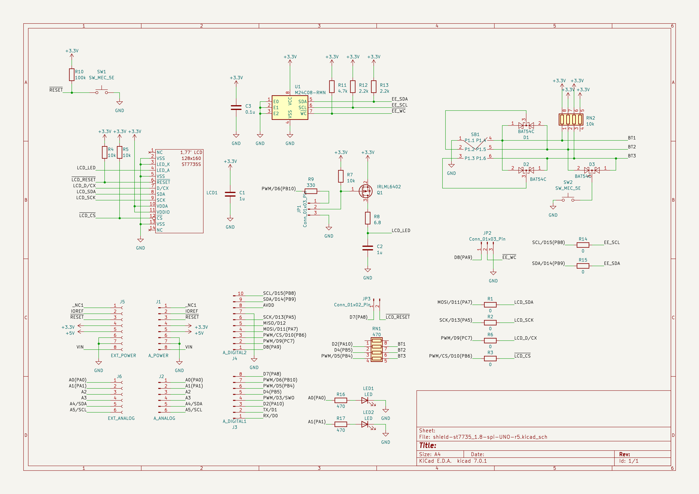

# nucleo64-lcd-st7735
LCD shield for STM32 Nucleo-64 boards.

This shield is designed for connecting to STM32 Nucleo-64 boards via ArduinoTM Uno V3.

**WARNING:** Although this shield can be connected to the ArduinoTM UNO, it is incompatible in logic levels, so it is strictly forbidden to connect this way, otherwise this display will fail!

### Hardware
* The GMT177-01 module is used as a display and is compatible in size and pins. The display controller used is **ST7735**. The display data bus is connected to the hardware SPI. PWM can be used  to control the brightness of the screen backlight.
* Joystick K1-1504SA-03 and one button KLS7-TS6601 can be used for control. Both are connected to 3 General Purpose I / O ports via diodes.
* EEPROM memory M24C08 can be used to store user data. This IC is connected to the I2C hardware bus.
* Two LEDs are connected to ports A0 (PA0) and A1 (PA1).
* A separate button IT-1187-160GM-G is provided to reset the controller.

### Demo firmware
Two versions of the demo firmware have been written to work on the NUCLEO-F446RE and this shield, one using CMSIS, the other using HAL. Both are under BSD-3-Clause License.
* Using CMSIS: [nucleo-f446re-st7735spi-shield](https://github.com/virxkane/nucleo-f446re-st7735spi-shield)
* Using HAL: [nucleo-f446re-st7735spi-shield-hal](https://github.com/virxkane/nucleo-f446re-st7735spi-shield-hal)

#### Compare performance
| # |  bpp variant  | fill period, ms | transfer period, CMSIS, ms | transfer period, HAL, ms |
|---|---------------|--------|-----------|---------|
| 1 | fb=1, lcd=12  |     3  |      23   |    40   |
| 2 | fb=1, lcd=16  |     3  |      30   |    60   |
| 3 | fb=1, lcd=18  |     3  |      44   |    74   |
| 4 | fb=4, lcd=12  |     3  |      23   |    39   |
| 5 | fb=4, lcd=16  |     3  |      30   |    58   |
| 6 | fb=4, lcd=18  |     3  |      44   |    73   |
| 7 | fb=8, lcd=12  |     2  |      23   |    39   |
| 8 | fb=8, lcd=16  |     2  |      30   |    59   |
| 9 | fb=8, lcd=18  |     2  |      44   |    73   |
| 10 | fb=16, lcd=12 |    3  |      22   |    39   |
| 11 | fb=16, lcd=16 |    3  |      30   |    59   |
| 12 | fb=16, lcd=18 |    3  |      44   |    75   |
| 13 | fb=24, lcd=12 |    3  |      22   |    38   |
| 14 | fb=24, lcd=16 |    3  |      30   |    61   |
| 15 | fb=24, lcd=18 |    3  |      44   |    73   |

Where *fb* - frame buffer color depth, *lcd* - LCD module color depth, *fill period* - frame buffer fill period, *transfer period* - period of frame buffer transmission to LCD module.

Tests performed at SPI clock 11,25 Mbits/s.

### Schematic

